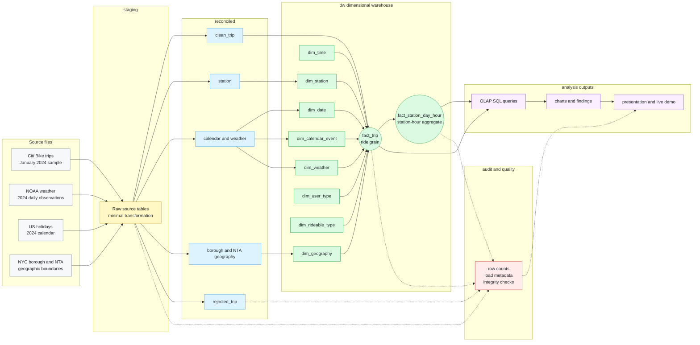

# Urban Night Mobility Data Warehouse

PostgreSQL/PostGIS data warehouse project for analyzing NYC Citi Bike night mobility, enriched with weather, public holidays, and NYC geographic boundaries.

The project implements a reproducible data warehousing pipeline with raw source acquisition, staging loads, a reconciled relational layer, a dimensional warehouse, OLAP SQL analyses, and quality checks. The validated development baseline uses the January 2024 Citi Bike sample; the pipeline is designed to scale to full-year 2024 execution.

## Project Highlights

- Real DBMS implementation in PostgreSQL with PostGIS spatial enrichment.
- Four-layer architecture: `staging`, `reconciled`, `dw`, and `audit`.
- Reconciled layer before the warehouse, with explicit rejected-trip accounting.
- Hybrid star/snowflake dimensional model with ride-grain and aggregate facts.
- Seven OLAP analyses across geography, time, calendar events, weather, rider type, rideable type, and station flows.
- Reproducibility and quality checks covering row counts, rejected records, foreign keys, unknown keys, and aggregate consistency.
- Presentation-ready charts and final slide deck.

## Validated Baseline

Latest local validation uses the January 2024 Citi Bike development sample plus full-year 2024 weather, holidays, and NYC boundaries.

| Metric | Value |
| --- | ---: |
| Staging Citi Bike rows | 1,888,085 |
| Accepted reconciled trips | 1,881,951 |
| Rejected staging trips | 6,134 |
| Warehouse ride-grain facts | 1,881,951 |
| Station-day-hour aggregate facts | 801,443 |
| Night trips | 285,097 |
| Reconciled stations | 2,262 |
| Stations assigned to NYC NTA | 2,223 |

## Architecture

| Layer | Schema / Path | Purpose |
| --- | --- | --- |
| Source files | `data_raw/` | Local raw downloads. Ignored by Git and reproduced through acquisition scripts. |
| Staging | `staging` | Raw-ish source loads with minimal transformation and load metadata. |
| Reconciled | `reconciled` | Cleaned and integrated relational data: trips, stations, calendar, weather, and geography. |
| Warehouse | `dw` | Dimensional facts and dimensions for OLAP analysis. |
| Audit / quality | `audit`, `sql/quality/` | Load metadata and row-count audit support, plus read-only integrity and coverage checks. |

### Data Warehouse Blueprint



Main warehouse facts:

- `dw.fact_trip`: one accepted Citi Bike ride.
- `dw.fact_station_day_hour`: one station, calendar day, and hour aggregate for faster station-flow analysis.

Main dimensions:

- `dw.dim_date`
- `dw.dim_time`
- `dw.dim_calendar_event`
- `dw.dim_weather`
- `dw.dim_geography`
- `dw.dim_station`
- `dw.dim_user_type`
- `dw.dim_rideable_type`

## Repository Structure

| Path | Purpose |
| --- | --- |
| `sql/` | DDL, transformations, warehouse loading, validation, quality checks, and OLAP queries. |
| `scripts/` | Python source acquisition, staging load, warehouse build, and quality-check wrappers. |
| `docs/` | Setup notes, source inventory, modeling notes, phase documentation, walkthrough, and charts. |
| `diagrams/` | DFM and physical schema diagrams. |
| `presentation/` | Slide deck PDF deliverables. |
| `reports/` | Optional local reports and exported outputs. |
| `data_raw/` | Local raw data files, intentionally ignored by Git. |
| `data_processed/` | Local intermediate outputs, intentionally ignored by Git. |

## Deliverables

| Artifact | Description |
| --- | --- |
| `presentation/Urban-Night-Mobility-Data-Warehouse_final.pdf` | Final project presentation deck. |
| `sql/olap/01_olap_analysis.sql` | Seven DBeaver-ready OLAP analyses. |
| `sql/quality/01_quality_checks.sql` | Read-only reproducibility and quality-check SQL. |
| `scripts/run_quality_checks.py` | Python wrapper that executes the quality-check SQL and prints results. |
| `docs/phase7_olap_analysis.md` | OLAP findings and interpretation notes. |
| `docs/phase8_quality_reproducibility.md` | Quality-check documentation and reproducibility baseline. |
| `docs/charts/phase7/` | SVG and PNG chart assets for the presentation. |
| `docs/hands_on_walkthrough.md` | Step-by-step local walkthrough for the demo and oral explanation. |

## Local Requirements

Required:

- Python 3.10+
- PostgreSQL 15+ or newer
- PostGIS extension
- DBeaver for browsing schemas and running demo SQL

Recommended backup:

- pgAdmin or terminal `psql`

Python dependencies are listed in `requirements.txt`.

## Setup

From the repository root:

```powershell
python -m venv .venv
.\.venv\Scripts\Activate.ps1
pip install -r requirements.txt
```

Create `.env` from the example and fill in local PostgreSQL credentials:

```powershell
Copy-Item .env.example .env
```

Create and initialize the database by following:

```text
docs/database_setup.md
```

Default database name:

```text
urban_night_mobility_dw
```

## Reproduce the Pipeline

Download source files:

```powershell
.\.venv\Scripts\python scripts\download_holidays.py --year 2024 --country-code US
.\.venv\Scripts\python scripts\download_citibike.py --months 202401
.\.venv\Scripts\python scripts\download_weather_noaa.py
.\.venv\Scripts\python scripts\download_nyc_boundaries.py
```

Load staging, build the reconciled layer, and populate the warehouse:

```powershell
.\.venv\Scripts\python scripts\load_staging.py --create-tables --dataset all
.\.venv\Scripts\python scripts\build_reconciled.py
.\.venv\Scripts\python scripts\build_warehouse_schema.py
.\.venv\Scripts\python scripts\build_warehouse.py
```

For final full-year execution, replace the Citi Bike acquisition step with:

```powershell
.\.venv\Scripts\python scripts\download_citibike.py --months all-2024
```

If the analysis period changes, update `docs/source_inventory.md`, `docs/phase8_quality_reproducibility.md`, and expected constants in `sql/quality/01_quality_checks.sql`.

## Run OLAP Analysis

Open the SQL file in DBeaver or run:

```powershell
psql -d urban_night_mobility_dw -v ON_ERROR_STOP=1 -f sql\olap\01_olap_analysis.sql
```

Implemented analysis sessions include:

- Night demand by borough and day type.
- Weather impact on casual vs member riders.
- Station inflow/outflow imbalance.
- Electric vs classic bike usage at night and under weather severity.
- Top night origin-destination NTA corridors.
- Holiday and long-weekend effects.
- Hourly night mobility profile.

See `docs/phase7_olap_analysis.md` for interpretation and `docs/charts/phase7/` for chart assets.

## Run Quality Checks

Run the quality checks after staging, reconciled, and warehouse layers have been built:

```powershell
.\.venv\Scripts\python scripts\run_quality_checks.py
```

Or run the SQL directly in DBeaver or `psql`:

```powershell
psql -d urban_night_mobility_dw -v ON_ERROR_STOP=1 -f sql\quality\01_quality_checks.sql
```

The quality checkpoint is documented in [docs/phase8_quality_reproducibility.md](docs/phase8_quality_reproducibility.md).

The quality suite verifies:

- source/staging row-count consistency;
- accepted + rejected trip accounting;
- duplicate ride IDs;
- invalid timestamps and durations;
- station geographic enrichment coverage;
- calendar and weather coverage;
- fact-to-dimension key integrity;
- ride-grain to aggregate-fact reconciliation;
- sanity of measures such as duration, distance, and trip counters.

## Database Convention

Default local database name: `urban_night_mobility_dw`

Schemas:

- `staging`: raw-ish loaded source tables.
- `reconciled`: cleaned integrated relational tables.
- `dw`: dimensional warehouse facts and dimensions.
- `audit`: load metadata and row-count audit support.

### Staging Rerun Note

`scripts/load_staging.py` appends rows to staging tables. Run it on a clean database, or truncate/reset staging tables before reloading the same raw files, to avoid duplicate raw rows.

## Demo Path

A compact 5-minute live demo can follow this order:

1. Show repository structure, `README.md`, and `PLAN.md`.
2. Open DBeaver and browse `staging`, `reconciled`, `dw`, and `audit`.
3. Open `dw.fact_trip` with related dimensions.
4. Run one query from `sql/olap/01_olap_analysis.sql`.
5. Run `scripts/run_quality_checks.py`.
6. Show findings in `docs/phase7_olap_analysis.md` and charts in `docs/charts/phase7/`.

## Key Limitations

- January 2024 is the validated development baseline; full-year 2024 execution is supported but not the current baseline.
- Weather enrichment uses daily Central Park observations, not station-level or hourly weather.
- Approximate distance is computed from station coordinates, not actual traveled routes.
- Station net-flow measures starts and ends, not real-time bike availability.
- User type and rideable type analyses are descriptive and do not imply causality.
