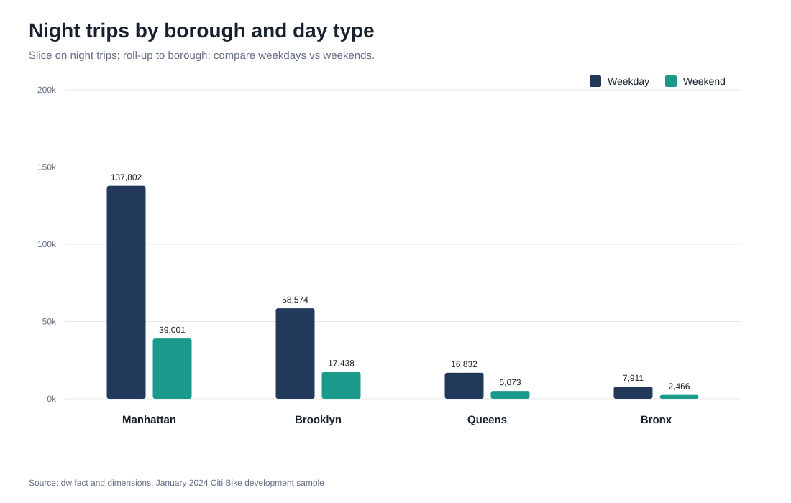
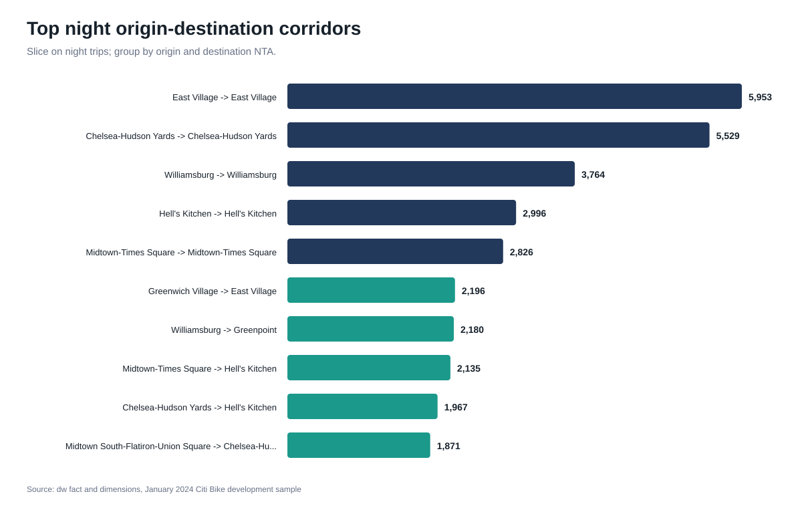
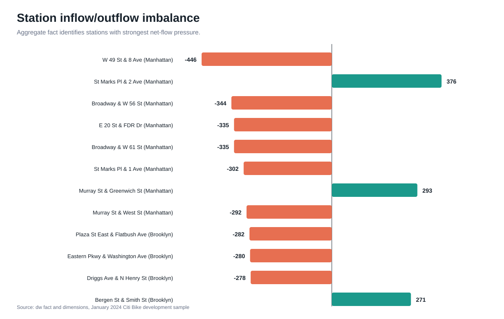
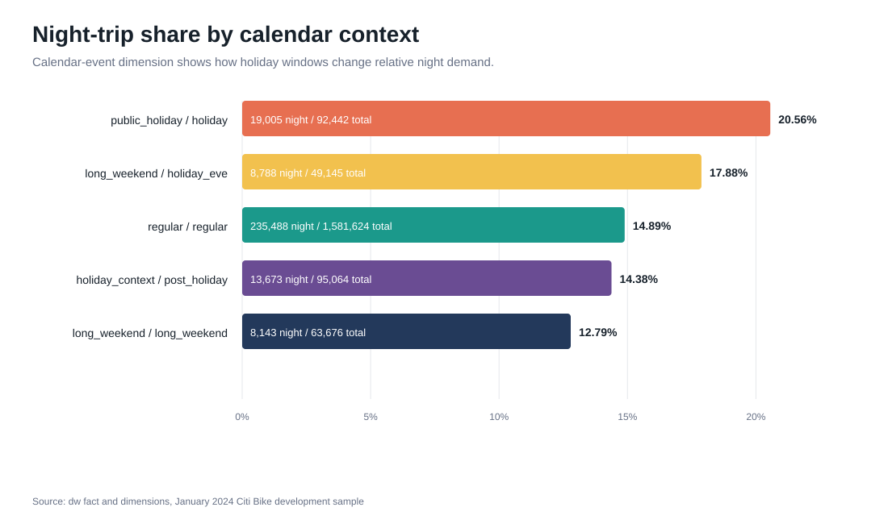

# Phase 7 - OLAP Analysis

This phase validates the analytical value of the dimensional warehouse by running OLAP queries on the populated January 2024 Citi Bike development sample.

The analysis uses the dimensional schema under `dw`, including:

- `dw.fact_trip`
- `dw.fact_station_day_hour`
- `dw.dim_date`
- `dw.dim_time`
- `dw.dim_geography`
- `dw.dim_station`
- `dw.dim_weather`
- `dw.dim_user_type`
- `dw.dim_rideable_type`
- `dw.dim_calendar_event`

The SQL queries are stored in:

```text
sql/olap/01_olap_analysis.sql
```

Selected chart assets for slides and discussion are stored in:

```text
docs/charts/phase7/
```

---

## Analysis 1 - Night demand by borough and day type

**OLAP operations:** slice, roll-up, dice.

This query slices the fact table on night trips, rolls up demand to the borough level, and compares demand across weekdays, weekends, and holiday windows.

**Main finding:**  
Night mobility is strongly concentrated in Manhattan, followed by Brooklyn. The highest observed group is Manhattan on regular weekdays, with **118,426 night trips**. Brooklyn regular weekdays follow with **49,212 night trips**. Manhattan regular weekends account for **28,800 night trips**.

Holiday-related windows show longer average trip durations. For example, Manhattan weekday holiday trips have an average duration of **12.56 minutes**, while Manhattan weekday regular trips have an average duration of **10.55 minutes**.

**Chart:**


---

## Analysis 2 - Weather impact on casual vs member riders

**OLAP operations:** dice, aggregation.

This query compares trip demand by rider type, weather condition class, and weather severity.

**Main finding:**  
Members account for much larger trip volumes than casual riders. Casual riders have longer average trip durations than members across the visible weather classes. For example, casual dry-weather trips have an average duration of **15.60 minutes**, while member trips are generally closer to about **10 minutes** in the visible output.

Adverse weather does not eliminate demand, but demand distribution changes across severity and condition classes. Rows with `unknown` weather should be treated as data-quality edge cases rather than central analytical evidence. They mostly reflect trips that started on **2023-12-31**, while the weather source covers calendar year 2024.

---

## Analysis 3 - Station inflow/outflow imbalance

**OLAP operations:** roll-up using the station-day-hour aggregate fact.

This query uses `dw.fact_station_day_hour` to identify stations where arrivals and departures are most imbalanced.

**Main finding:**  
The strongest station-level imbalances are concentrated in Manhattan. Examples include:

| Station | Borough | Net flow |
|---|---:|---:|
| W 49 St & 8 Ave | Manhattan | -446 |
| St Marks Pl & 2 Ave | Manhattan | 376 |
| Broadway & W 56 St | Manhattan | -344 |
| Broadway & W 61 St | Manhattan | -335 |
| E 20 St & FDR Dr | Manhattan | -335 |

Negative net flow means more departures than arrivals. Positive net flow means more arrivals than departures. These results identify stations where rebalancing pressure is likely higher.

For presentation purposes, the net-flow idea is also aggregated to NTA level in a companion chart under Analysis 5, so it can be compared directly with the top night origin-destination corridors.

---

## Analysis 4 - Electric vs classic bike usage at night and under weather severity

**OLAP operations:** pivot-like aggregation.

This query compares bike type usage by day/night class and weather severity.

**Main finding:**  
Classic bikes dominate the visible output. Day trips are much more frequent than night trips across all weather severity classes. For classic bikes, moderate-severity day trips account for **187,545 trips**, while moderate-severity night trips account for **28,679 trips**.

Rows with `unknown` severity and extreme average duration are treated as data-quality edge cases. They are useful to mention in Phase 8 quality checks, but they should not drive the main weather interpretation.

---

## Analysis 5 - Top night origin-destination corridors

**OLAP operations:** slice and origin-destination grouping.

This query slices on night trips and groups by start/end borough and start/end NTA.

**Main finding:**  
Top night corridors are mostly short intra-neighborhood trips. The strongest visible corridors are:

| Origin NTA | Destination NTA | Night trips |
|---|---|---:|
| East Village | East Village | 5,953 |
| Chelsea-Hudson Yards | Chelsea-Hudson Yards | 5,529 |
| Williamsburg | Williamsburg | 3,764 |
| Hell's Kitchen | Hell's Kitchen | 2,996 |
| Midtown-Times Square | Midtown-Times Square | 2,826 |

This supports the interpretation that night Citi Bike mobility is highly local and concentrated around dense nightlife and mixed-use areas.

**Chart:**


**Companion chart:**


The companion chart uses the same NTA areas appearing in the top corridor chart and computes night net-flow as `night ends - night starts`. This makes the directional interpretation clearer: for example, Greenwich Village and Williamsburg behave more like night origins, while East Village and Greenpoint behave more like night destinations.

---

## Analysis 6 - Holiday and long-weekend effects

**OLAP operations:** roll-up by calendar-event classification.

This query compares ordinary days, public holidays, holiday eves, post-holidays, and long-weekend contexts.

**Main finding:**  
Public holidays have the highest night-trip share, with **19,005 night trips** out of **92,442 total trips**, equal to **20.56%**. Holiday eves also show an elevated night-trip share of **17.88%**. Regular days have a lower night-trip share of **14.89%**.

This suggests that holiday-related contexts increase the relative importance of night mobility.

**Chart:**


---

## Analysis 7 - Hourly night mobility profile

**OLAP operations:** drill-down to hourly granularity.

This query drills down demand by start hour and separates weekdays from weekends.

**Main finding:**  
The warehouse defines night mobility as trips starting between **20:00 and 05:59**. The hourly drill-down confirms that `night_trips` are present from **20:00 to 23:00** and from **00:00 to 05:00**, while they become zero from **06:00 to 19:00**. This validates the night-trip flag and separates evening/night mobility from daytime demand.

The 5 AM weekday value is relatively high, with **14,613 night trips**, which may reflect early commuting or transitional mobility rather than nightlife only.

---

## Summary

The OLAP analysis confirms that the warehouse supports multidimensional analysis across geography, time, weather, rider type, bike type, station flow, and calendar-event context.

The strongest findings are:

1. Manhattan dominates night mobility demand.
2. Night corridors are mostly local intra-neighborhood movements.
3. Public holidays and holiday eves increase the relative share of night trips.
4. Station imbalance is concentrated around high-demand Manhattan stations.
5. Weather and rider type dimensions allow demand differences between casual and member riders to be analyzed.
